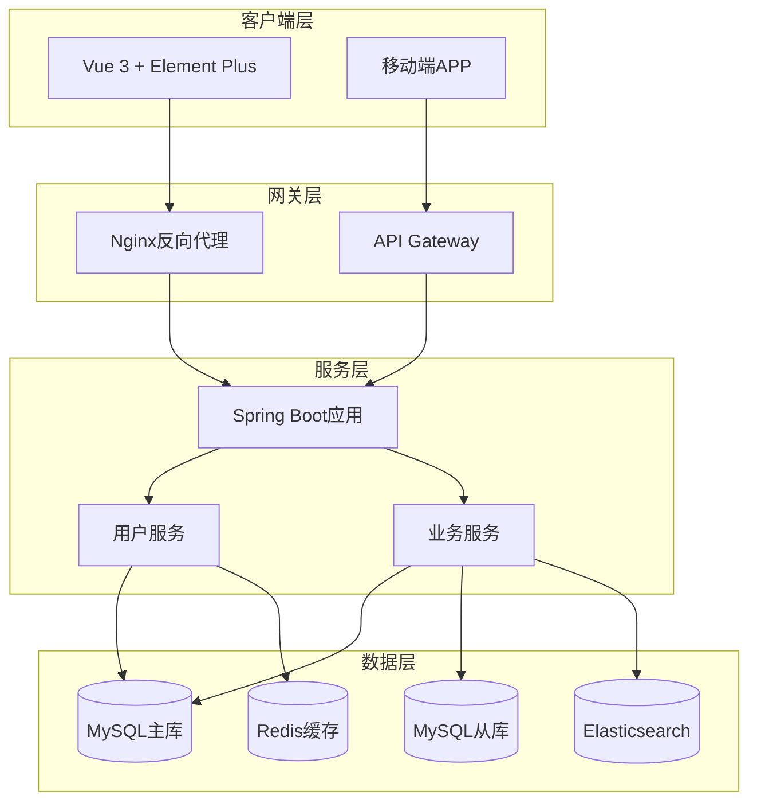
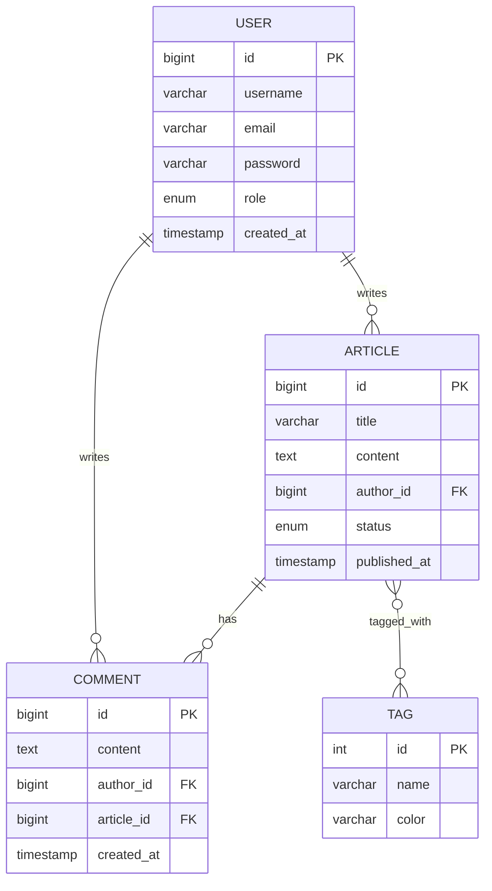
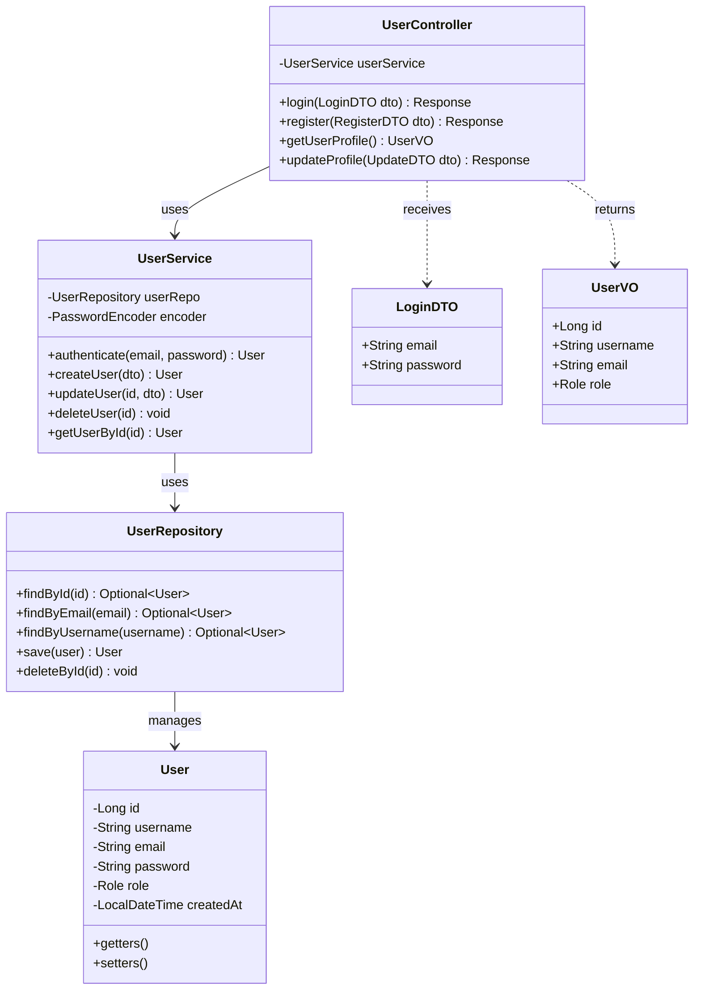
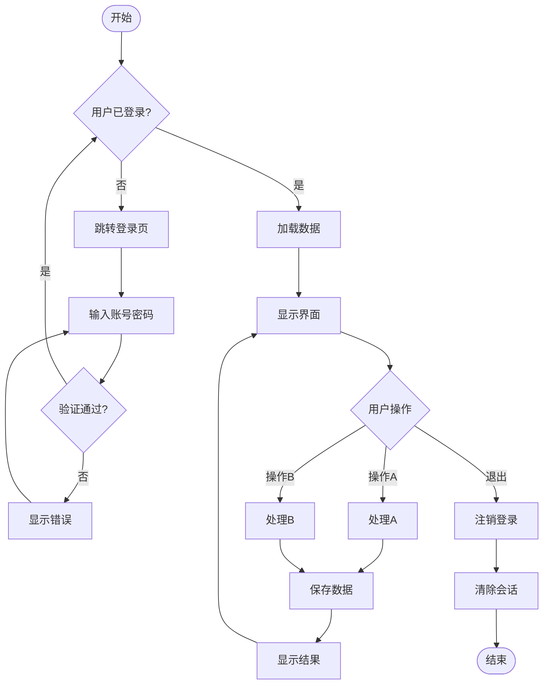
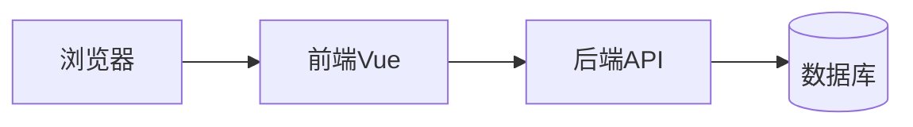
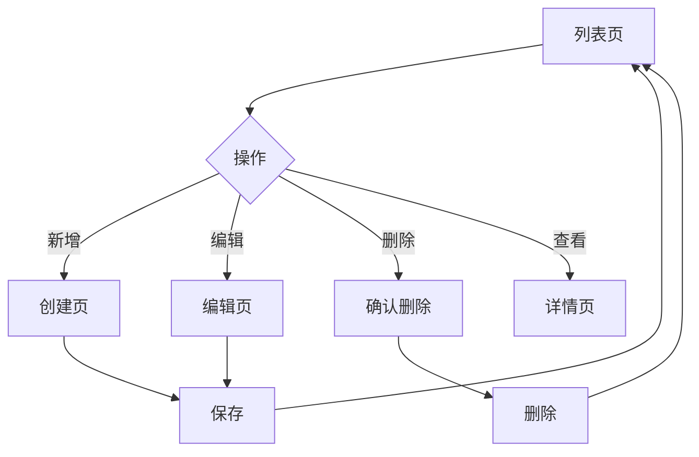
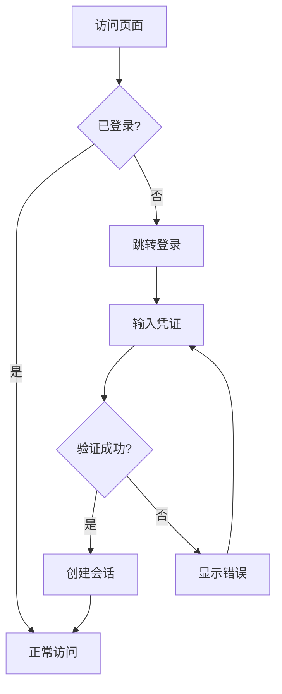

# Diagram Generation for Software Engineering

Generate Mermaid diagrams from text descriptions and design documents.

**Previous Skill**: Invoked by other phase skills (se-requirements, se-architecture, se-detailed-design)

**Next Skill**: Returns to calling skill

## Core Principles

### 1. Text to Diagram
- Parse natural language or structured text
- Generate corresponding Mermaid syntax
- Ensure diagram accuracy and completeness

### 2. Standard Notation
- Follow UML standards for structure diagrams
- Use clear, readable naming conventions
- Include relationships and cardinalities

### 3. Completeness
- Include all entities/actors mentioned
- Show all relationships
- Add necessary attributes/fields

## Diagram Types

### 1. Use Case Diagram (usecase.mmd)

**Input**: Requirement description, user roles, features
**Output**: Mermaid usecase diagram

**Generation Rules**:
1. Identify all actors (users, external systems)
2. Identify all use cases (features/functions)
3. Group related use cases into packages
4. Connect actors to use cases they interact with

**Template**:
```mermaid
usecaseDiagram
    actor "Actor1" as A1
    actor "Actor2" as A2
    
    package "System Name" {
        usecase "Use Case 1" as UC1
        usecase "Use Case 2" as UC2
        usecase "Use Case 3" as UC3
    }
    
    A1 --> UC1
    A1 --> UC2
    A2 --> UC3
    
    UC1 ..> UC2 : <<include>>
    UC3 ..> UC2 : <<extend>>
```

**Example Generation**:
```
Input: "校园学习平台有学生、教师、管理员三种角色。学生可以浏览博客、发布博客、在线答题。教师可以组卷、审核文章。管理员可以管理用户。"

Output:
```mermaid
usecaseDiagram
    actor "学生" as Student
    actor "教师" as Teacher
    actor "管理员" as Admin
    
    package "校园学习平台" {
        usecase "浏览博客" as UC1
        usecase "发布博客" as UC2
        usecase "在线答题" as UC3
        usecase "组卷" as UC4
        usecase "审核文章" as UC5
        usecase "用户管理" as UC6
    }
    
    Student --> UC1
    Student --> UC2
    Student --> UC3
    Teacher --> UC4
    Teacher --> UC5
    Admin --> UC6
```
```

### 2. Architecture Diagram (architecture.mmd)

**Input**: Tech stack, system components, deployment info
**Output**: Mermaid graph showing system architecture

**Generation Rules**:
1. Group components by layer (client, gateway, backend, data)
2. Show connections between components
3. Include technology labels
4. Indicate data flow direction

**Template**:


### 3. ER Diagram (erdiagram.mmd)

**Input**: Database design, entity descriptions
**Output**: Mermaid ER diagram

**Generation Rules**:
1. Identify all entities (tables)
2. Identify attributes for each entity
3. Mark primary keys (PK) and foreign keys (FK)
4. Define relationships with cardinalities

**Template**:


**Relationship Notations**:
- `||--o{` : One to Many
- `||--||` : One to One
- `}o--o{` : Many to Many
- `}|--|{` : Many to One

### 4. Class Diagram (classdiagram.mmd)

**Input**: Module design, class descriptions
**Output**: Mermaid class diagram

**Generation Rules**:
1. Identify all classes
2. Define attributes (visibility + type)
3. Define methods (visibility + params + return)
4. Show relationships (inheritance, composition, association)

**Template**:


**Visibility Notations**:
- `+` : public
- `-` : private
- `#` : protected
- `~` : package

**Relationship Types**:
- `-->` : Association
- `..>` : Dependency
- `--|>` : Inheritance
- `--*` : Composition
- `--o` : Aggregation

### 5. Flowchart (flowchart.mmd)

**Input**: Business process description
**Output**: Mermaid flowchart

**Generation Rules**:
1. Identify start and end points
2. Identify decision points (diamonds)
3. Identify process steps (rectangles)
4. Show alternative paths

**Template**:


**Node Types**:
- `[文本]` : Process
- `{文本}` : Decision
- `([文本])` : Start/End
- `[[文本]]` : Subroutine
- `[(文本)]` : Database
- `{{文本}}` : Preparation

## Usage Workflow

### Step 1: Identify Diagram Type
Based on current phase:
- Requirements → Use Case Diagram
- Architecture → Architecture + ER Diagram
- Detailed Design → Class + Flowchart

### Step 2: Extract Information
Parse input for:
- Entities/Actors
- Attributes/Features
- Relationships
- Processes/Flows

### Step 3: Generate Mermaid Syntax
Follow templates and rules above.

### Step 4: Validate
Check for:
- Completeness (all elements included)
- Correctness (valid Mermaid syntax)
- Clarity (readable names and labels)

### Step 5: Save and Reference
- Save to `docs/diagrams/[filename].mmd`
- Reference in main document
- Include in version control

## Integration with Other Skills

### With se-requirements
Input: Requirement.md
Output: usecase.mmd

### With se-architecture
Input: Design.md
Output: architecture.mmd + erdiagram.mmd

### With se-detailed-design
Input: DetailedDesign.md
Output: classdiagram.mmd + flowchart.mmd

## Best Practices

1. **Keep it Simple**: Don't include too many elements in one diagram
2. **Consistent Naming**: Use consistent naming conventions
3. **Group Related Elements**: Use subgraphs/packages for organization
4. **Show Key Relationships**: Focus on important connections
5. **Update with Changes**: Keep diagrams in sync with code

## Common Patterns

### Web Application Pattern


### CRUD Pattern


### Authentication Pattern

