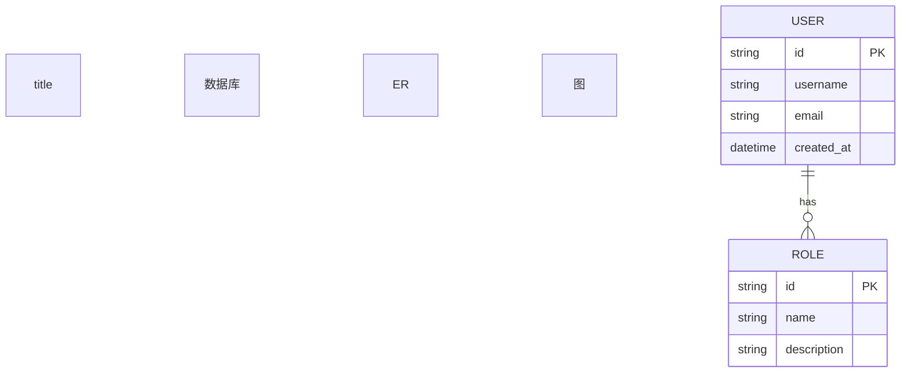
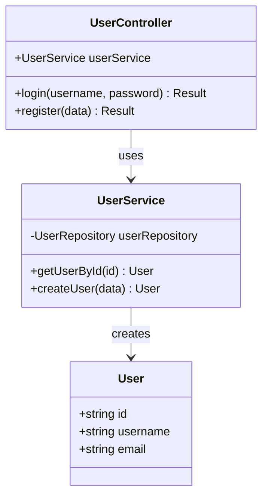
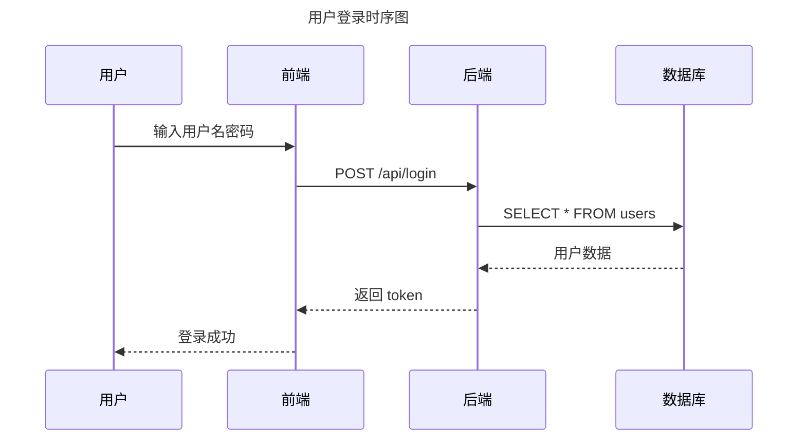
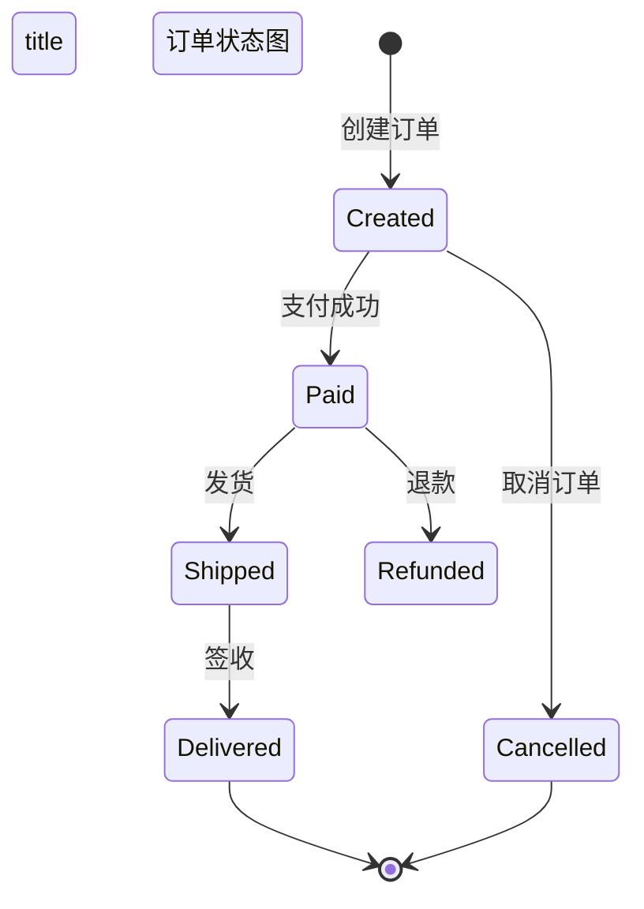

# Mermaid 图表模板

## 1. 用例图模板

```mermaid
usecaseDiagram
    title [系统名称] 用例图
    
    actor "用户角色 1" as U1
    actor "用户角色 2" as U2
    actor "外部系统" as E1
    
    package "[系统名称]" {
        usecase "功能 1" as UC1
        usecase "功能 2" as UC2
        usecase "功能 3" as UC3
    }
    
    U1 --> UC1
    U1 --> UC2
    U2 --> UC2
    U2 --> UC3
    E1 --> UC3
```

**使用场景：**
- 需求分析阶段
- 展示系统功能范围
- 明确用户角色与功能关系

---

## 2. ER 图模板



**使用场景：**
- 详细设计阶段
- 数据库 schema 设计
- 展示实体关系

---

## 3. 类图模板



**使用场景：**
- 详细设计阶段
- 展示类关系
- 代码结构预览

---

## 4. 流程图模板

```mermaid
flowchart TD
    title 业务流程图
    
    Start([开始])
    Step1[步骤 1: 用户登录]
    Decision{验证成功？}
    Step2[步骤 2: 进入系统]
    Error[错误处理]
    End([结束])
    
    Start --> Step1
    Step1 --> Decision
    Decision -->|是 | Step2
    Decision -->|否 | Error
    Step2 --> End
    Error --> End
```

**使用场景：**
- 业务流程说明
- 算法流程展示
- 审批流程设计

---

## 5. 时序图模板



**使用场景：**
- API 交互说明
- 系统间调用流程
- 请求响应时序

---

## 6. 状态图模板



**使用场景：**
- 对象生命周期
- 状态流转逻辑
- 工作流设计

---

## 使用指南

### 1. 保存为 .mmd 文件

```bash
# 保存到 docs/diagrams/ 目录
docs/diagrams/
├── usecase.mmd          # 用例图
├── architecture.mmd     # 架构图
├── erdiagram.mmd        # ER 图
├── classdiagram.mmd     # 类图
├── flowchart.mmd        # 流程图
└── sequence.mmd         # 时序图
```

### 2. 在 Markdown 中引用

```markdown
## 用例图

```mermaid
{{include 'docs/diagrams/usecase.mmd'}}
```
```

### 3. 在线预览

- [Mermaid Live Editor](https://mermaid.live/)
- VS Code 插件：Markdown Preview Mermaid Support
